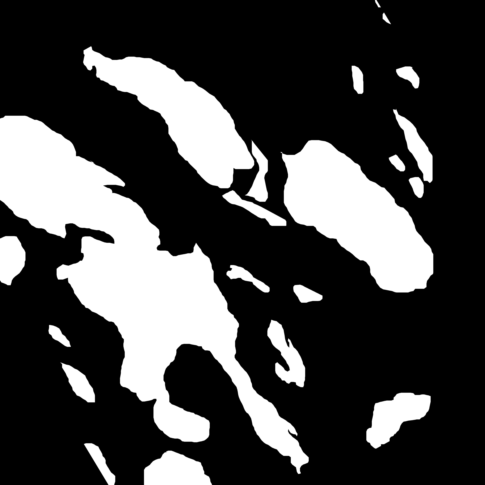
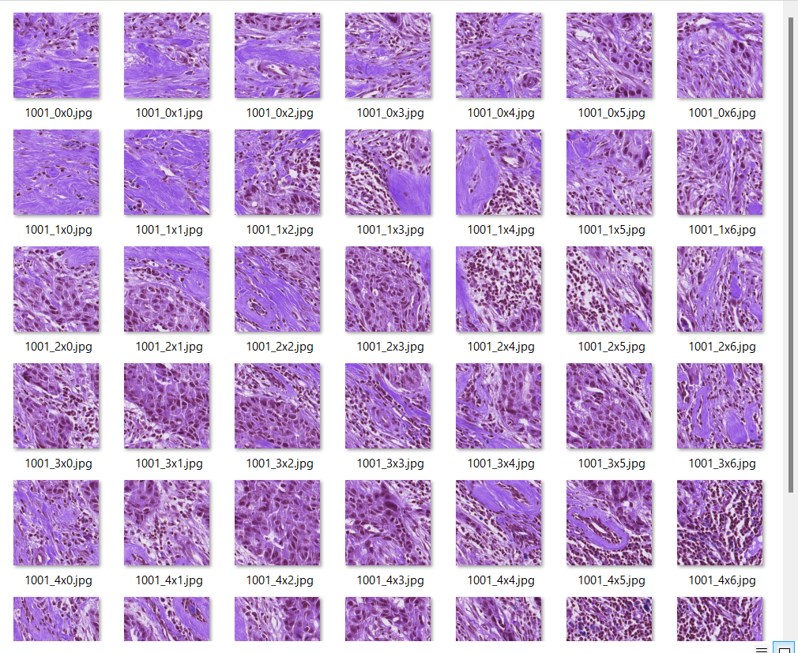
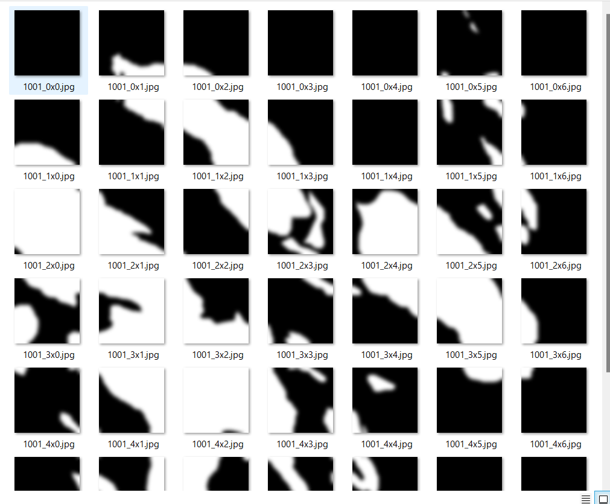
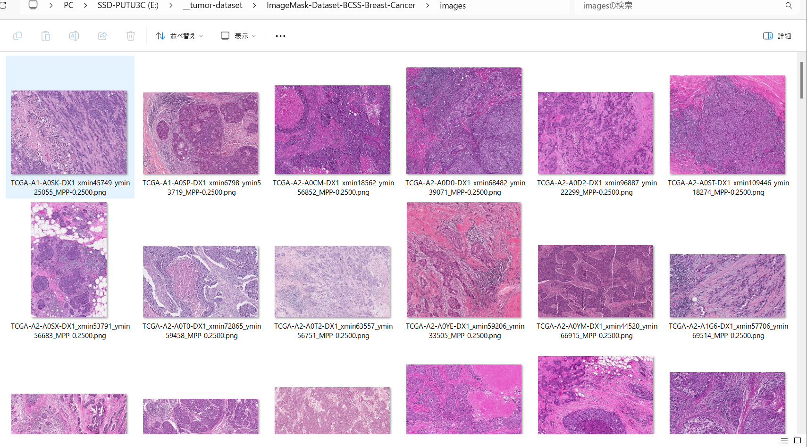
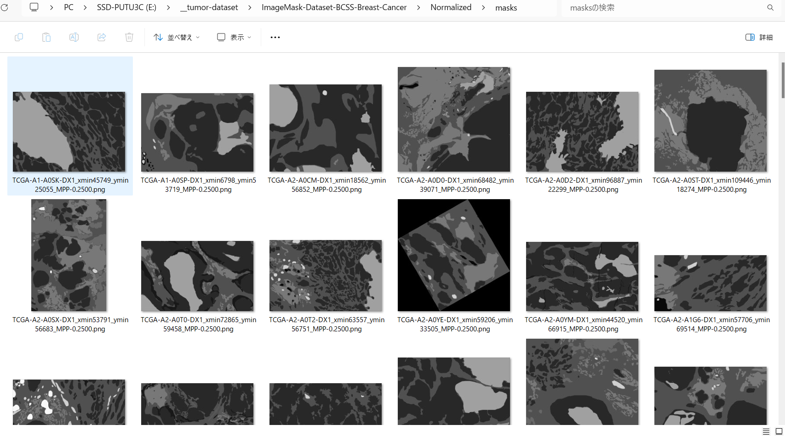
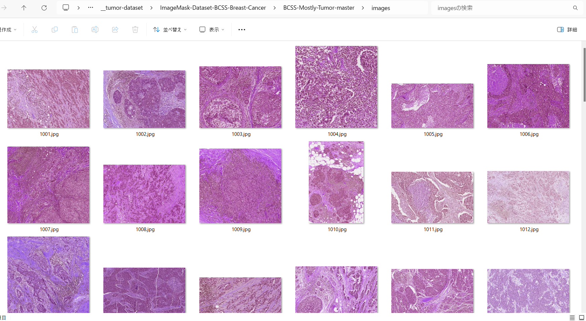
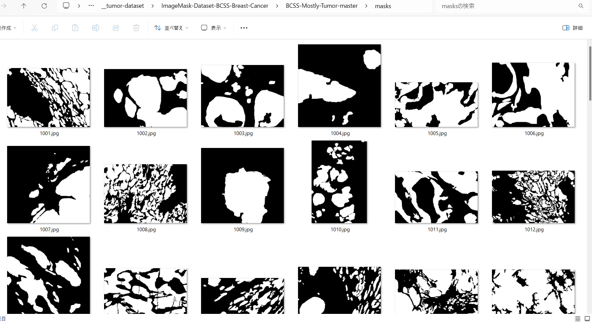
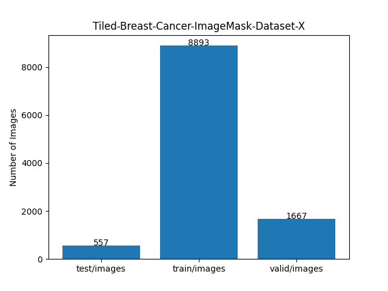
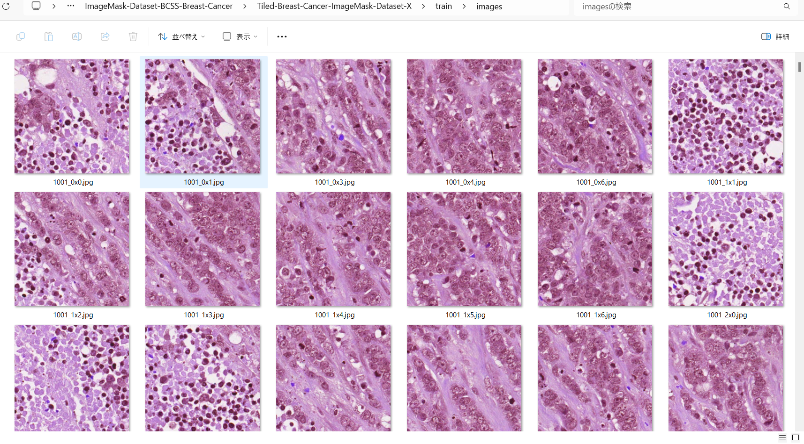
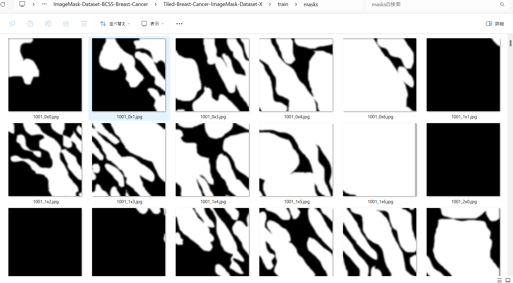

<h2>Tiled-ImageMask-Dataset-Breast-Cancer (2024/05/27) </h2>
</h2>
This is a Tiled-Breast-Cancer ImageMask Dataset for Image-Segmentation. 
 
We have created a tiled image and mask dataset from the original large size image and mask files in 

<a href="https://github.com/PathologyDataScience/BCSS">
Breast Cancer Semantic Segmentation (BCSS) dataset
</a>

 
The pixel-size of the original images and masks in 
image and mask BCSS dataset is from 2K to 7K, 
and too large to use for a training of an ordinary segmentation model.
Therefore we have created a dataset of images and masks, split into small tiles of 512x512 pixels, 
which can be used for a segmentation model.  
<!--
By training a segmentation model by the new tiled dataset, we will try to improve segmentation accuracy for the 
large Skin-Cancer images of 4K or 6K pixel size.    
 -->
 

For example, an image and mask of 4090x4090 pixel-size can be split to the tiles as shown below. 

<b>Image and Mask</b>
<table>
<!--
<tr>
<th>
Image
</th>
<th>Mask</th>
</tr>
-->
<tr>
<td>

</td>
<td>

</td>
</tr>
</table>
 
<b>Tiled Image and Mask</b>
<table>
<!--
<tr>
<th>
Tiled-Image
</th>
<th>Tiled-Mask</th>
</tr>
-->
<tr>
<td>

</td>
<td>

</td>

</tr>
</table>

 
<b>Download Tiled-Image-Mask-Dataset</b> 
You can download our dataset created here from the google drive 
<a href="https://drive.google.com/file/d/1IedbpmttIgY17pPUbS0uliugD7rlkFJQ/view?usp=sharing">Tiled-Breast-Cancer-ImageMask-Dataset-X.zip</a>
 

<h3>1. Dataset Citation</h3>
The original dataset used here has been taken from the following github repository. 

<a href="https://github.com/PathologyDataScience/BCSS">
Breast Cancer Semantic Segmentation (BCSS) dataset
</a>
 
 
On detail of this dataset, please refer to the following paper. 

<a href="https://academic.oup.com/bioinformatics/article/35/18/3461/5307750?login=false">
<b>Structured crowdsourcing enables convolutional segmentation of histology images</b> 
</a> 
Bioinformatics, Volume 35, Issue 18, September 2019, Pages 3461–3467,  
https://doi.org/10.1093/bioinformatics/btz083 
Published: 06 February 2019 

Mohamed Amgad, Habiba Elfandy, Hagar Hussein, Lamees A Atteya, Mai A T Elsebaie, Lamia S Abo Elnasr,  
Rokia A Sakr, Hazem S E Salem, Ahmed F Ismail, Anas M Saad, Joumana Ahmed, Maha A T Elsebaie,  
Mustafijur Rahman, Inas A Ruhban, Nada M Elgazar, Yahya Alagha, Mohamed H Osman, Ahmed M Alhusseiny,  
Mariam M Khalaf, Abo-Alela F Younes, Ali Abdulkarim, Duaa M Younes, Ahmed M Gadallah, Ahmad M Elkashash,  
Salma Y Fala, Basma M Zaki, Jonathan Beezley, Deepak R Chittajallu, David Manthey, 
David A Gutman, Lee A D Cooper 

 
<b>Dataset Licensing</b> 
This dataset itself is licensed under a CC0 1.0 Universal (CC0 1.0) license. 

<h3>2. Download master dataset</h3>
Please clone the following github repository. 
<a href="https://github.com/PathologyDataScience/BCSS">
Breast Cancer Semantic Segmentation (BCSS) dataset
</a>
  
Please set up Python environemnt to download BCSS dataset. 
If you would like download all dataset, <b>images, masks, annotations</b>, probably you will have to modify <b>PIPELINE </b>
in config.py file as shown below. 
<pre>
# What things to download? -- comment out whet you dont want
PIPELINE = (
    'images',
    'masks',
    'annotations',
)
</pre>
Please run the following command to download the BCSS dataset  
<pre>
>python python download_crowdsource_dataset.py
</pre>
, by which the following folders will be created.  
<pre>
./Tiled-ImageMask-Dataset-Breast-Cancer
├─annotations  : JSON annotation files
├─images       ; PNG image files
├─masks        : PNG mask files
└─meta         
</pre>

BCSS images sample 
  

BCSS normalized masks sample 
  

By checking <b>./meta/gtruth_codes.tsv</b>,
you can identify the labels included in this annotations dataset as shown below. 
<pre>
--------------------------------
label                   GT_code
--------------------------------
outside_roi             0
tumor                   1
stroma                  2
lymphocytic_infiltrate  3
necrosis_or_debris      4
glandular_secretions    5
blood                   6
exclude                 7
metaplasia_NOS          8
fat                     9
plasma_cells            10
other_immune_infiltrate 11
mucoid_material         12
normal_acinus_or_duct   13
lymphatics              14
undetermined            15
nerve                   16
skin_adnexa             17
blood_vessel            18
angioinvasion           19
dcis                    20
other                   21
</pre>
As shown above, a lot of labels is included in it. However, for simplicity, we created ImageMask Dataset for <b>Tumor</b>. 

<h3>3. Create Mostly-Tumor Dataset</h3>
To create Mostly Tumor ImateMask dataset, please run the following command for Python script, 
<a href="./ImageMaskDatasetGenerator.py">ImageMaskDatasetGenerator.py</a>. 
<pre>
>python ImageMaskDatasetGenerator.py
</pre>

This script executes the following image processing to create Tumor-ImageMask-Dataset. 

Processing for image files in images folder: 
1. Read a png image file in images folder of BCSS.  
2  Resize the width and height of the image to be a minimum integral multiple of 512 respectively. 
3. Save the resize image as a jpg file. 

 
Processing for the json files in annotations folder: 
1. Read a json_file in annotations folder of BCSS. 
2, Parse the json data, and get a header part of the data. 
3. Get center, image_width, image_height from the header part. 
4. Create an empty mask of image_width and imagte_height. 
5. Find <b>mostly_tumor</b> group in a body part of the json data. 
6. Get a set of <b>points</b> of a polygon which represents a mostly_tumor region. 
7. Fill the mask with the set of points as a polygon. 
8. Resize the width and height of the mask to be a minimum integral multiple of 512 respectively. 
9. Save the resize mask as a jpg file. 
 
By using script, the following dataset will be created. 
<pre>
./BCSS-Mostly-Tumor-master
├─images       ; JPG image files
└─masks        : JPG mostly_tumor mask files
</pre>

Generate images sample 
  

Generated mostly_tumor masks sample 
  

<h3>4. Create Tiled Dataset</h3>
To create Tiledly-Split-ImageMask-Dataset from <b>BCSS-Mostly-Tumor-master</b> , please run the following command for Python script, 
<a href="./TiledImageMaskDatasetGenerator.py">TiledImageMaskDatasetGenerator.py</a>. 
<pre>
>python TiledImageMaskDatasetGenerator.py
</pre>
By this command, the following folder will be created. 
<pre>
./Tiled-BCSS-Mostly-Tumor-master
├─images       ; Tiledly-split image files
└─masks        : Tiledly-split mask files
</pre>

<h3>5. Spit master</h3>
To split Tiledly-Split-ImageMask-Dataset to test, train, and valid sub datasets,
 please run the following command for Python script, 
<a href="./split_master.py">split_master.py</a>. 
<pre>
>python split_master.py
</pre>
By this command, the following folder will be created. 
<pre>
./Tiled-Breast-Cancer-ImageMask-Dataset-X
├─test
│  ├─images
│  └─masks
├─train
│  ├─images
│  └─masks
└─valid
    ├─images
    └─masks
</pre>

<b>Dataset Statistics</b> 
 

<b>train/images samples:</b> 

 
<b>train/masks samples:</b> 

 

<h3>Reference</h3>
<b>1. Structured crowdsourcing enables convolutional segmentation of histology images</b> 
Bioinformatics, Volume 35, Issue 18, September 2019, Pages 3461–3467,  
https://doi.org/10.1093/bioinformatics/btz083 
Published: 06 February 2019 

Mohamed Amgad, Habiba Elfandy, Hagar Hussein, Lamees A Atteya, Mai A T Elsebaie, Lamia S Abo Elnasr,  
Rokia A Sakr, Hazem S E Salem, Ahmed F Ismail, Anas M Saad, Joumana Ahmed, Maha A T Elsebaie,  
Mustafijur Rahman, Inas A Ruhban, Nada M Elgazar, Yahya Alagha, Mohamed H Osman, Ahmed M Alhusseiny,  
Mariam M Khalaf, Abo-Alela F Younes, Ali Abdulkarim, Duaa M Younes, Ahmed M Gadallah, Ahmad M Elkashash,  
Salma Y Fala, Basma M Zaki, Jonathan Beezley, Deepak R Chittajallu, David Manthey, 
David A Gutman, Lee A D Cooper 

<pre>
https://academic.oup.com/bioinformatics/article/35/18/3461/5307750?login=false
</pre>

